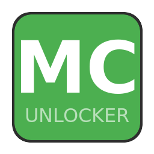

# Minecraft Bedrock Unlocker

<p align="center">
  
  <br>
  <a href="https://github.com/CoelhoFZ/MinecraftBedrockUnlocker/releases"></a>
  
  
</p>

Unlock the full version of **Minecraft Bedrock Edition (GDK)** on Windows 10/11.

**Only works with Xbox App installations** (NOT the Microsoft Store version).

> ⚠️ Educational project. Please support the developers by purchasing the game.

## Install

1. Install Minecraft from the **Xbox App** and run it once.
2. Open **PowerShell** and run:

```powershell
irm https://github.com/CoelhoFZ/MinecraftBedrockUnlocker/raw/main/i.ps1 | iex
```

3. The installer opens Minecraft automatically. The "Unlock full game" button is gone.

> The installer scripts are **open source** (GPLv3). Only the unlock binary
> (`release/winmm.dll`) is closed source — see [LICENSE](LICENSE).

Alternative (manual): clone the repo and run `.\install.ps1`:

```powershell
git clone https://github.com/CoelhoFZ/MinecraftBedrockUnlocker
cd MinecraftBedrockUnlocker
.\install.ps1
```

The installer locates the game's `Content` folder, closes the game if it is
running, backs up any original `winmm.dll` (as `winmm.dll.orig`) and installs
the unlock. Old artifacts from previous versions are removed.

To remove the unlock later, run the installer again and choose **Remove
unlock**. For a manual removal (without the menu), run `.\uninstall.ps1`.

## Self-contained, no third-party downloads

Nothing is downloaded from third parties at install time or at runtime. The
unlock is a **closed-source binary** shipped in this repository:

- `release/winmm.dll` — the only file the game needs (a fake `winmm.dll` that
  is picked up by the app's DLL search order).

## How it works (high level)

Minecraft's GDK build asks a Windows API (`xgameruntime!QueryApiImpl`) whether
the license entitlements are owned. The shipped `winmm.dll` intercepts those
queries and reports "owned", so the game runs as if fully purchased. Everything
else (account, gamertag, profile) stays real.

## Closed source

The binaries are **closed source** — the unlock mechanism is not published
here. They are hardened against reverse engineering:

- The actual unlock payload does not exist as a file: it is an **encrypted
  blob embedded inside `winmm.dll`**, mapped manually at runtime by a custom
  loader (two encrypted stages, per-build keys).
- No revealing strings, no import table of the packer path, no symbols/RTTI.
- Anti-debug (multiple layers), anti-tamper (integrity checks at load and a
  watchdog at runtime), anti-dump.

See `LICENSE` for the terms.

## Binary integrity

`SHA256SUMS.txt` lists the expected hash of `release/winmm.dll`. Verify before
installing:

```powershell
Get-FileHash .\release\winmm.dll -Algorithm SHA256
```

## Antivirus / SmartScreen

The unlock binary is **closed source**, so Windows Defender or SmartScreen may
show a false-positive warning. This is expected. Verify the binary before
installing using the SHA-256 in `SHA256SUMS.txt` (see "Binary integrity").
Only ever run the installer from this repository.

## 🚨 SCAM ALERT

Scammers spread **fake "unlocker fix"** links in Discord chats using short
URLs and the pattern `irm <short-link> | iex`. **That is NOT this project** —
it downloads a remote access trojan.

- The **ONLY official source** is this repository:
  `https://github.com/CoelhoFZ/MinecraftBedrockUnlocker`
- **NEVER** run `irm <anything> | iex` from a short link (bit.ly, tinyurl, …),
  another domain, a Discord DM or a random server.
- The official installer only ever copies the files in this repository.
